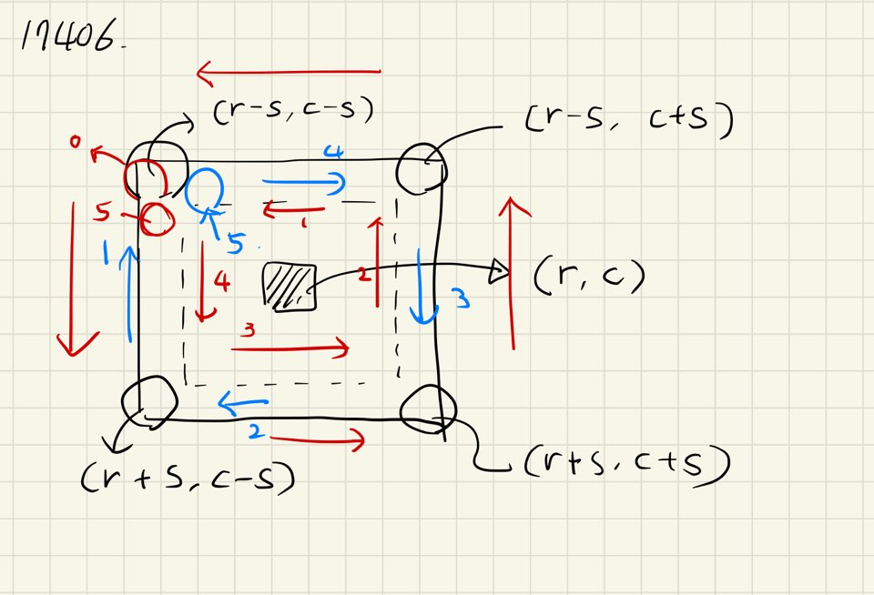

# 배열돌리기
> 삼성 sw 기출문제

## 문제 알고리즘
- dfs문제

## 풀이방법
1. dfs를 통한 경로 가능한 경우를 다 구한다.
2. 재귀적으로 dfs를 호출하면서 K개의 회전 순서를 다 돌린 이후, 최소 합을 구한다.
3. 돌린 이후에는 다시 반대편으로 돌려준다.

- 풀이 사진

- 핵심 코드
~~~c++int board[MAX][MAX];						// array
int N, M, K;								// N, M, K
pair<pair<int, int>, int> K_list[K_MAX];	// <<r, c>, s> 
bool visited[K_MAX];
int ans = INF;

// get Row Miminum Sum
int getMinSize() {
	int tmp = INF;
	for (int i = 1; i <= N; i++) {
		int count = 0;
		for (int j = 1; j <= M; j++)
			count += board[i][j];
		tmp = min(tmp, count);
	}
	return tmp;
}

// if dir is 1,   
void circleTurn(int r, int c, int s, int dir) {
	// end state
	if (s < 1)
		return;
	if (dir == 1) {										// step
		int tmp = board[r - s][c - s];				// 0
		for (int i = r - s; i < r + s; i++)			// 1
			board[i][c - s] = board[i + 1][c - s];
		for (int j = c - s; j < c + s; j++)			// 2
			board[r + s][j] = board[r + s][j + 1];
		for (int i = r + s; i > r - s; i--)			// 3
			board[i][c + s] = board[i - 1][c + s];
		for (int j = c + s; j > c - s + 1; j--)		// 4
			board[r - s][j] = board[r - s][j - 1];
		board[r - s][c - s + 1] = tmp;				// 5
		circleTurn(r, c, s - 1, dir);
	}
	else {											// step
		int tmp = board[r - s][c - s];				// 0
		for (int j = c - s; j < c + s; j++)			// 1
			board[r - s][j] = board[r - s][j + 1];
		for (int i = r - s; i < r + s; i++)			// 2
			board[i][c + s] = board[i + 1][c + s];
		for (int j = c + s; j > c - s; j--)			// 3
			board[r + s][j] = board[r + s][j - 1];
		for (int i = r + s; i > r - s + 1; i--)		// 4
			board[i][c - s] = board[i - 1][c - s];
		board[r - s + 1][c - s] = tmp;				// 5
		circleTurn(r, c, s - 1, dir);
	}
	return;
}

void dfs(int k_count) {
	if (k_count == 0) {
		ans = min(ans, getMinSize());
		return;
	}
	for (int i = 0; i < K; i++) {
		if (!visited[i]) {
			circleTurn(K_list[i].first.first, K_list[i].first.second, K_list[i].second, 1);
			visited[i] = true;

			dfs(k_count - 1);

			visited[i] = false;
			circleTurn(K_list[i].first.first, K_list[i].first.second, K_list[i].second, 0);
		}
	}
}
~~~

## 문제 후 느낀점
- dfs문제 및 단순 구현문제
