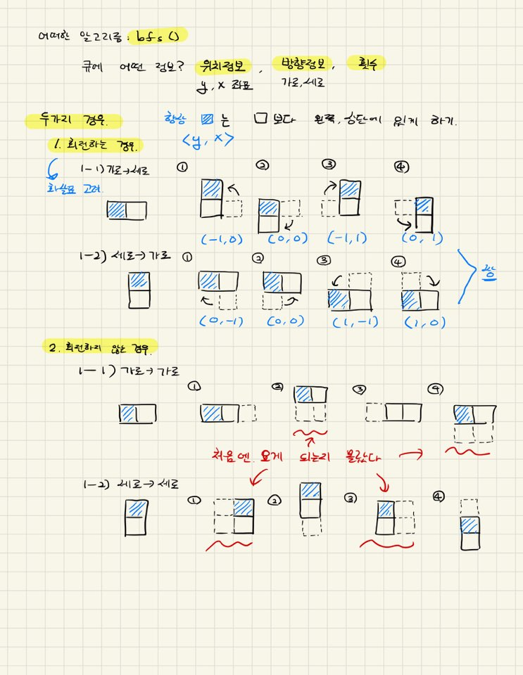

# [2020 카카오 공채] 블록 이동하기

## 문제 알고리즘
- bfs

## 풀이방법
1. bfs를 통한 가능 경로를 탐색한다.
2. 추가적인 코드는 다음의 그림에 기반한다

현재 36점 풀이

- 핵심 코드
~~~c++
int bfs(vector<vector<int>> board, int y1, int x1, int y2, int x2) {
	queue<robot> q;
	robot t;
	t.y1 = y1;	t.y2 = y2;	t.x1 = x1;	t.x2 = x2;	t.ver = true;	t.cnt = 0;
	q.push(t);
	visited[0][0][0][1] = true;

	while (!q.empty()) {
		int curY1 = q.front().y1;	int curX1 = q.front().x1;
		int curY2 = q.front().y2;	int curX2 = q.front().x2;
		bool curVer = q.front().ver;	int curCnt = q.front().cnt;
		q.pop();

		// end state
		if (curY2 == N - 1 && curX2 == N - 1)
			return curCnt;

		// push state
		for (int i = 0; i < 6; i++) {
			int nextY1, nextX1, nextY2, nextX2;
			if (curVer) {
				nextY1 = curY1 + small_pos_y[i];
				nextX1 = curX1 + small_pos_x[i];
				nextY2 = nextY1 + other_dir_y[i];
				nextX2 = nextX1 + other_dir_x[i];
			}
			else {
				nextY1 = curY1 + small_pos_x[i];
				nextX1 = curX1 + small_pos_y[i];
				nextY2 = nextY1 + other_dir_x[i];
				nextX2 = nextX1 + other_dir_y[i];
			}
			bool isVertical;
			if (abs(nextX2 - nextX1))
				isVertical = true;
			else
				isVertical = false;

			if (0 <= nextY1 && nextY1 < N && 0 <= nextX1 && nextX1 < N)
				if (0 <= nextY2 && nextY2 < N && 0 <= nextX2 && nextX2 < N)
					if (!board[nextY1][nextX1] && !board[nextY2][nextX2] && !visited[nextY1][nextX1][nextY2][nextX2])
						if (isSafeTurn(board, nextY1, nextX1, curVer, i)) {
							t.y1 = nextY1;	t.x1 = nextX1;	t.y2 = nextY2;	t.x2 = nextX2;	t.ver = isVertical;	 t.cnt = curCnt + 1;
							q.push(t);
							visited[nextY1][nextX1][nextY2][nextX2] = true;
						}
		}
	}
	return -1;
}
~~~

